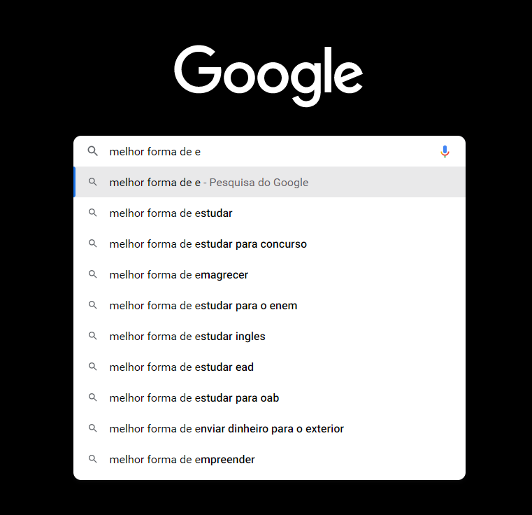

# Análise do buscador - Quidiane

Dupla: Charlon Fernandes e Evellyn Santana

## Usando os conceitos de affordance

O psicólogo James Gibson propôs a conceituação de Affordances em 1977 com o intuito de caracterizar a capacidade de um objeto em ser identificado de forma intuitiva pelos seus atributos, tais como forma, tamanho e peso, sem necessidade de explicações. Tal característica permite ao indivíduo compreender as funcionalidades do objeto em questão. Para a análise do nosso primeiro projeto utilizamos três parametros do doutor Gibson, affordance explícito, padrão e matáforico.

- **Explícito**: É quando tornamos um elemento óbvio e claro das suas funcionalidades, indicando exatamente o que precisa ser feito — na tela principal do buscador temos a palavra "Pesquise..." para que até os usuários nunca antes expostos a tecnologia podem noção do que pode ser feito no sistema.

- **Padrão**: São baseadas nas experiências anteriores e que são conhecidas para maioria dos usuários. Os clássicos links são azuis e quando o curso passa por cima, automaticamente, ele é sublinhado dando a ideia de que é uma âncora para outra informação

- **Métaforas**: Na criação de interfaces digitais, é comum a utilização de objetos do mundo real como metáforas, sendo que ícones e símbolos são exemplos expressivos disso. Podemos citar alguns, tais como carrinho de compras, envelope, telefone, vídeo, câmera e impressora, entre outros. Utilizamos dois:
    - *Lupa* - Na página index, a lupa envidência que o campo está relacionado com a pesquisa.

    - *Microfone* - O botão com o ícone do microfone remente a noção de falar, fezendo a métafora de que se pode falar para pesquisar.

    

## IHC

- IHC(interação humano-máquina) é uma área da computação que busca, sobretudo, entender como as pessoas usam os computadores e fazer a investigação de outras formas de interação. A palavra "pesquise" dentro da barra de busca induz a interração humano máquina, pois o comando escrito na tela, de certa forma, induz o psicologico do usuário a pesquisar.

## Arquitetura de Informação

A Arquitetura de Informação é a prática que busca desenvolver um método de apresentação e disposição das informações, e que trabalha em conjunto com diversas áreas, como Design, UX e SEO.

Na prática, ela se encarrega de organizar o conjunto de dados existentes para auxiliar as pessoas a encontrar o que estão buscando, seja no mundo digital ou fora dele.

Nesse aspecto, **falhamos**, já que a tela de resultado entrega uma serie de informações soltas, Imagens e link totalmente dispersos e tornando o uso confuso.

## Design Visual

A ideia do Quidiane é ser um buscador simples e intuitivo, por isso cores neutras, imagens e icones não muitos chamativos não foram utilizados para deixar a experiencia do usuário mais limpa. 

## 5 Critérios de USABILIDADE

### Eficácia 

A eficácia se trate de os usuários poderem completar seus objetivos com um alto grau de precisão. Grande parte da eficácia de um produto vem do suporte fornecido aos usuários quando eles trabalham com o produto. 

O site pecou nesse aspecto, ele não é muito eficaz. Por exemplo, poderia teras sugestões de pesquisa conforme você digita, como temos em outros. 

### Eficiência

Eficiência trata-se sobre velocidade. O quão mais rápido o usuário consegue fazer uma tarefa específica usando a sua interface, melhor ela será.

O Quidiane é eficiente, com apenas um clique o curso já está liberado e a pesquisa pode ser encaminhada com um simples ENTER.

### Engajamento 

O engajamento acontece quando o usuário acha um produto agradável e gosta de usar ele. É basicamente isso. A estética também é muito importante, e é por isso que muitas empresas investem em elementos de design visual.

O layout padrão de buscadores e facilidade de navegação por conta de uma tela menos poluida causa um maior engajamento de uso

### Tolerância ao erro

É praticamente impossível conseguirmos eliminar exatamente todos os erros em nossos aplicativos e sites. Alguns erros podem aparecer de forma inesperada

Novamente a tela limpa e o termo "pesquise" e sendo o único input clicável deixa a chance dos usuários errarem torna quase impossível errar durante a conclusão do seu objetivo.

### Fácil de aprender

Os usuários que estão assimilados com a tecnologia disponível possuem mais facilidade com os equipamentos e, consequentemente, com os aplicativos disponíveis

Site puramente intuitivo, não tem precisão de aprendizado, ou de muita ação cognitiva para compreender o buscador.